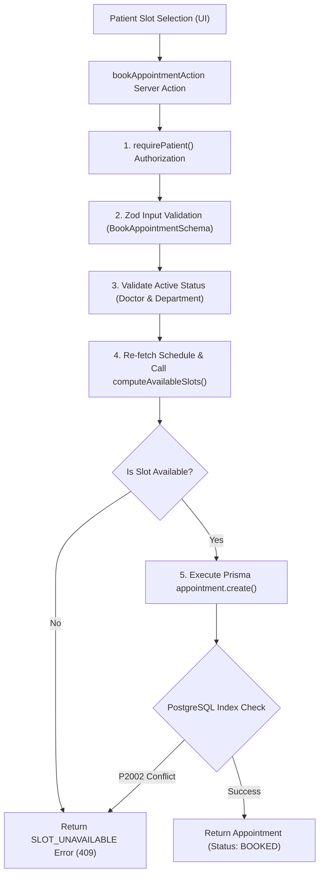

# Transactional Appointment Booking Architecture

## 1. Executive Summary & Flow
**Phase 5C** implements the real patient appointment booking transaction in the Hospital Appointment Management System. It converts client slot selections into an atomic database booking transaction.



## 2. Double Booking Prevention Principle

> [!IMPORTANT]
> **Architectural Guarantee:** Application-level availability checking (`computeAvailableSlots()`) provides domain validation and user feedback; the PostgreSQL partial unique index (`unique_active_doctor_slot`) provides the final concurrency guarantee.

### How Double Booking Is Prevented (Step-by-Step Scenario):
1. **Patient A** and **Patient B** both open Dr. Jane Smith's profile simultaneously. Both see the 10:30 AM slot as available.
2. Both patients click **Confirm Appointment** at virtually the same second.
3. **Server Action Execution:**
   - Server Action for Patient A re-fetches schedule data and calls `computeAvailableSlots()`.
   - Server Action for Patient B re-fetches schedule data and calls `computeAvailableSlots()`.
   - Both initial slot re-computations may see the slot as open if neither INSERT has committed yet.
4. **Database Execution & Concurrency Guard:**
   - Both actions attempt `prisma.appointment.create()` with status `BOOKED`.
   - **PostgreSQL Partial Unique Index (`unique_active_doctor_slot`):**
     ```sql
     CREATE UNIQUE INDEX unique_active_doctor_slot 
     ON "Appointment" ("doctorId", "appointmentDate", "startTime") 
     WHERE status IN ('BOOKED', 'CONFIRMED');
     ```
   - **Winner (Patient A):** The first INSERT transaction commits successfully. Appointment status is `BOOKED`.
   - **Loser (Patient B):** The second INSERT violates `unique_active_doctor_slot` and fails with Prisma error `P2002`.
5. **Error Mapping & UX Recovery:**
   - The server catches `P2002` and returns a typed result:
     `{ success: false, code: 'SLOT_UNAVAILABLE', message: 'This time slot was just booked by another patient. Please choose another slot.' }`
   - Patient B's browser displays a clear warning notice and automatically refreshes available slots (excluding the taken 10:30 AM slot).

## 3. Server-Side Validation Rules

| Field | Validation Rule | Error Response |
| :--- | :--- | :--- |
| `patientId` | Resolved strictly from authenticated session (`user.patientProfile.id`). Never accepted from client payload. | `UNAUTHORIZED` |
| `doctorId` | Validated against `DoctorProfile` and active `User` & `Department`. | `DOCTOR_UNAVAILABLE` |
| `appointmentDate` | Format `YYYY-MM-DD`, calendar date, not in the past (`Asia/Kolkata`). | `VALIDATION_ERROR` |
| `startTime` | Format `HH:mm`, exact 30-minute grid (`:00` or `:30`). Rejects `:15`, `:45`, `:01`. | `VALIDATION_ERROR` |
| `endTime` | Calculated strictly on server (`startTime + 30 minutes`). Client value ignored. | N/A |
| `status` | Initial status is strictly `BOOKED`. Client status field forbidden. | N/A |

## 4. Error Codes & Mapping

- `UNAUTHORIZED`: Unauthenticated user or missing patient profile.
- `VALIDATION_ERROR`: Malformed date, past date, or non-grid start time.
- `DOCTOR_UNAVAILABLE`: Inactive doctor or deactivated department.
- `SLOT_UNAVAILABLE`: Slot taken by concurrent booking or blocked date (P2002 mapped).
- `SERVER_ERROR`: Unexpected database or system error.
