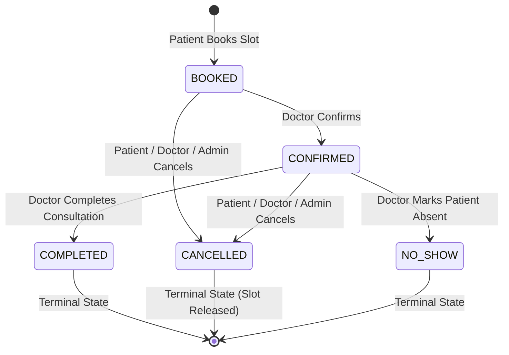

# Hospital Appointment Lifecycle & State Machine Architecture

## 1. Overview & Approved Status Model
The Hospital Appointment Management System supports **ONLY** the following 5 statuses:
- `BOOKED`: Created upon initial patient slot selection.
- `CONFIRMED`: Doctor accepts/confirms outpatient consultation.
- `COMPLETED`: Doctor marks consultation finished after appointment.
- `CANCELLED`: Patient, Doctor, or Admin cancels appointment.
- `NO_SHOW`: Doctor marks patient absent for confirmed consultation.

> [!CAUTION]
> Statuses such as `SCHEDULED`, `PENDING`, `RESERVED`, or `WAITING` do NOT exist and are strictly forbidden.

## 2. State Machine & Valid Transitions



### Transition Enforcement Matrix
| Current Status | Target Status | Permitted Actors | Business Rules & Validation |
| :--- | :--- | :--- | :--- |
| `BOOKED` | `CONFIRMED` | `DOCTOR` | Doctor accepts appointment. |
| `BOOKED` | `CANCELLED` | `PATIENT`, `DOCTOR`, `ADMIN` | Patient cannot cancel past appointments (`Asia/Kolkata`). Releases slot. |
| `CONFIRMED` | `COMPLETED` | `DOCTOR` | Doctor completes consultation. Terminal state. |
| `CONFIRMED` | `CANCELLED` | `PATIENT`, `DOCTOR`, `ADMIN` | Releases slot via PostgreSQL partial unique index. |
| `CONFIRMED` | `NO_SHOW` | `DOCTOR` | Patient absent. Terminal state. |

## 3. Role Permissions Matrix

| Feature / Action | PATIENT | DOCTOR | ADMIN |
| :--- | :--- | :--- | :--- |
| **Browse / Search Doctors** | ✅ | ✅ | ✅ |
| **Book Appointment** | ✅ (Own Profile) | ❌ | ❌ |
| **View Appointments List** | ✅ (Own) | ✅ (Own) | ✅ (System-Wide) |
| **Cancel Appointment** | ✅ (Own Upcoming) | ✅ (Own) | ✅ |
| **Confirm Appointment** | ❌ | ✅ (Own) | ❌ |
| **Complete Appointment** | ❌ | ✅ (Own) | ❌ |
| **Mark No-Show** | ❌ | ✅ (Own) | ❌ |
| **Master Data (Depts/Doctors)** | ❌ | ❌ | ✅ |

## 4. Slot Release & Database Integrity
When an appointment is cancelled (`status = CANCELLED`), the record is **never deleted** from PostgreSQL.
The partial unique index:
```sql
CREATE UNIQUE INDEX unique_active_doctor_slot 
ON "Appointment" ("doctorId", "appointmentDate", "startTime") 
WHERE status IN ('BOOKED', 'CONFIRMED');
```
automatically excludes `CANCELLED` appointments, immediately making the 30-minute slot available for other patients to book without manual slot cleanup.
