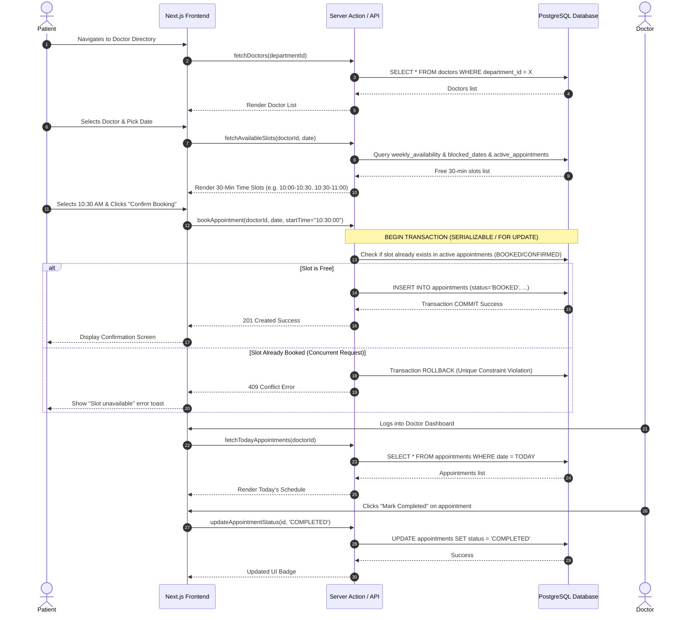

# MVP Scope Specification
## Hospital Appointment Management System

**Document Version:** 1.1.0 (Corrected Specification)  
**Purpose:** Define the minimal viable product boundaries, implementation plan, and risk analysis for Phase 1.

---

## 1. Executive Summary

The MVP focus is **deliberately tight**: demonstrating a single, rock-solid, concurrent-safe core workflow:

> **Patient Registers ➔ Log in ➔ Search Doctor ➔ Pick 30-Min Available Slot ➔ Book Appointment (Status: BOOKED) ➔ Doctor Views Dashboard ➔ Doctor Confirms/Completes Appointment**

All non-essential modules (billing, prescriptions, pharmacy, labs, notifications, telehealth) are excluded from Phase 1.

---

## 2. In-Scope (P0) vs Out-of-Scope (P1/P2) Feature Matrix

| Feature Area | In MVP (P0) | Post-MVP (P1 / P2) |
| :--- | :--- | :--- |
| **Authentication** | NextAuth.js Credentials Auth, Patient registration, Role-based route protection. | OAuth (Google/Apple), Multi-factor Auth (MFA). |
| **Department & Doctor Management** | Admin CRUD for departments & doctor profiles, Doctor active status toggle. | Multi-hospital branches, doctor ratings, profile image uploads. |
| **Doctor Availability** | Standard weekly hours (e.g. Mon-Fri 9-5) with 30-min fixed slots & date block overrides. | Dynamic variable slot durations, multi-location schedule switching. |
| **Slot Booking** | Fixed 30-min slot picker, atomic transaction reservation, concurrency check. | Recurrent bookings, multi-slot reservation. |
| **Appointment Lifecycle** | Statuses: `BOOKED`, `CONFIRMED`, `COMPLETED`, `CANCELLED`, `NO_SHOW`. | Rescheduling, Automated waitlist queues. |
| **Notifications** | On-screen toast notifications & status badges. | Email (Resend) and SMS (Twilio) reminders. |
| **Testing** | Playwright end-to-end test for booking flow & double booking. | Full visual regression suite. |

---

## 3. End-to-End Core Patient -> Doctor Workflow

---

## 4. Recommended Implementation Order (Step-by-Step)

To maintain clean progression and avoid architectural debt, implementation should follow these 6 phases:

### Phase 1: Project Setup, NextAuth.js & Database Schema
- Initialize Next.js app with NextAuth.js (Credentials Provider + Prisma Adapter).
- Set up Prisma schema (`User`, `PatientProfile`, `DoctorProfile`, `Department`, `WeeklyAvailability`, `BlockedDate`, `Appointment`).
- Apply PostgreSQL migrations and partial unique constraint index:
  `UNIQUE("doctorId", "appointmentDate", "startTime") WHERE status IN ('BOOKED', 'CONFIRMED')`.

### Phase 2: Authentication & RBAC Foundation
- Implement Next.js authentication middleware for role-based route protection (`/patient/*`, `/doctor/*`, `/admin/*`).
- Build Login and Patient Registration forms with Zod validation.

### Phase 3: Admin Module (Data Seeding & Onboarding)
- Admin Department management pages.
- Admin Doctor creation page (creating User + DoctorProfile + default availability).

### Phase 4: Doctor Schedule Configuration Module
- Doctor Weekly Availability UI (setting working hours per day, 30-min slot grid).
- Doctor Blocked Date management.

### Phase 5: Patient Search & Concurrent Booking Engine
- Doctor search/filtering UI.
- Fixed 30-min slot generation algorithm (calculating working hours MINUS blocked dates MINUS active `BOOKED`/`CONFIRMED` appointments).
- Server Action for booking with database atomic locking & error handling for race conditions.

### Phase 6: Dashboards, Lifecycle Actions & E2E Testing
- Patient "My Appointments" & Cancellation.
- Doctor "Today's Schedule" & Status updates (`CONFIRMED`, `COMPLETED`, `NO_SHOW`, `CANCELLED`).
- Playwright E2E test verifying successful booking and concurrent booking rejection.

---

## 5. Major Technical Risks & Mitigation Strategies

| Risk | Impact | Mitigation Strategy |
| :--- | :--- | :--- |
| **Double Booking Race Condition** | High (Critical) | Enforce PostgreSQL Partial Unique Index `WHERE status IN ('BOOKED', 'CONFIRMED')` + Prisma interactive transaction catch block to gracefully inform losing request. |
| **Incorrect Slot Generation Logic** | Medium | Standardize on fixed 30-minute grid slots. Isolate slot computation into pure, unit-tested utility functions (`computeAvailableSlots(workingHours, blockedDates, activeAppointments)`). |
| **Complexity Overload for Beginners** | Medium | Use NextAuth.js v5 / Auth.js standard library rather than custom crypto/cookie code. Rely strictly on Next.js Server Components, Server Actions, React Hook Form, and Zod. |
| **Stale Availability Data** | Low | Re-validate slot availability server-side right at the moment of booking submission, not just when rendering the page. |

---

## 6. Summary

### What WILL Be Built:
1. NextAuth.js Authentication with Patient, Doctor, and Admin roles.
2. Department & Doctor Directory with filtering.
3. Doctor Schedule & Exception Manager (Fixed 30-min slots).
4. Concurrency-Safe Time Slot Booking Engine.
5. Patient, Doctor, and Admin Management Dashboards.
6. Playwright E2E Test Suite.

### What WILL NOT Be Built:
1. Billing / Insurance / Payment Gateways.
2. Electronic Medical Records (EMR).
3. Pharmacy & Laboratory modules.
4. Telehealth video calls.
5. Inpatient / Hospital ward management.
