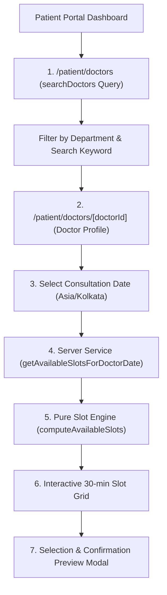

# Patient Doctor Discovery & Slot Selection Specification

## 1. Overview & Scope
**Phase 5B** introduces the patient-facing doctor discovery directory (`/patient/doctors`) and interactive doctor profile slot picker (`/patient/doctors/[doctorId]`).

> [!IMPORTANT]
> **Non-Authoritative Client Display:** The browser displays available 30-minute slots retrieved from the server, but client slot selection is non-authoritative. Actual appointment creation, race-condition guards, and database transactions occur exclusively in **Phase 5C**.

## 2. Component Architecture

### A. Patient Layout Shell (`src/app/(dashboard)/patient/layout.tsx`)
- Server-side authenticated layout guarded by `requirePatient()`.
- Responsive navigation header, brand logo, patient identity badge, and link shortcuts.

### B. Doctor Search & Discovery (`src/features/doctors/queries.ts`)
- `searchDoctors()`: Parameterized Prisma query with case-insensitive name/specialization search, department filter, and pagination (20 doctors/page).
- **Security Projection:** Explicity projects only professional public fields (`id`, `fullName`, `phoneNumber`, `qualification`, `experienceYears`, `bio`, `department`, `user.email`). **Strictly excludes `passwordHash`**.
- **Active Filter Enforcement:** Only doctors with `isActive: true`, `user.isActive: true`, and `department.isActive: true` are returned.

### C. Available Slot Retrieval Service (`src/features/appointments/services/get-available-slots.ts`)
- Server service connecting Prisma database reads to the pure `computeAvailableSlots` domain engine.
- Validates doctor active status, department active status, and date format (`YYYY-MM-DD`).
- Retrieves `WeeklyAvailability`, `BlockedDate`, and active `Appointment` (`BOOKED`, `CONFIRMED`) records for the requested date.
- Executes `computeAvailableSlots` with `Asia/Kolkata` timezone context.
- **NO DATABASE WRITES occur.**

### D. Slot Picker & Preview Modal (`src/features/appointments/components/DoctorProfileSlotPicker.tsx`)
- Groups available slots into Morning (before 12:00 PM), Afternoon (12:00 PM - 05:00 PM), and Evening (after 05:00 PM).
- Highlights selected slot and displays slot summary bar.
- Opens Confirmation Preview Modal displaying Doctor Name, Specialty, Date, Time Slot, and Notice.
- Disables appointment submission until Phase 5C.

## 3. Boundary & Error Handling
- **Past Date Selection:** Rejected by both date picker (`min={todayDate}`) and server validation.
- **Full-Day Blocked Date:** Displays friendly message `"Doctor is unavailable on this date"`.
- **Empty Availability / Fully Booked:** Displays `"No appointments are available for this date"`.
- **Inactive Doctor:** Shows unavailable notice `"This doctor is currently unavailable for appointments"`.
- **404 Doctor Not Found:** Triggers standard Next.js `notFound()`.
