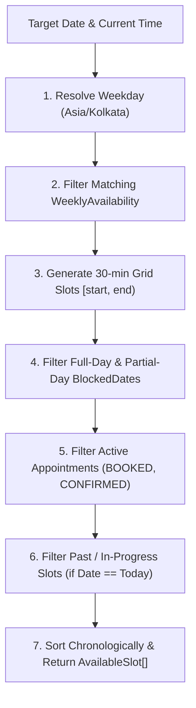

# Appointment Slot Engine Specification

## 1. Overview & Purpose
The **Appointment Slot Computation Engine** (`src/features/appointments/domain/slot-engine.ts`) is a pure, deterministic domain service responsible for calculating available 30-minute appointment slots for a given doctor on a requested date.

$$\text{Available Slots} = \text{WeeklyAvailability} \setminus \text{BlockedDates} \setminus \text{ActiveAppointments} \setminus \text{PastSlots}$$



## 2. Core Architectural Guarantees
- **Pure Function:** Zero database queries, zero authentication checks, zero React component bindings, zero Server Action dependencies.
- **Deterministic Output:** Identical inputs yield identical outputs.
- **Timezone Consistency:** Weekday resolution and current-time comparisons use `Asia/Kolkata` (`NEXT_PUBLIC_HOSPITAL_TIMEZONE`).
- **Half-Open Interval Semantics:** All time intervals are processed as $[start, end)$.
- **Fixed 30-Minute Grid:** Slots start on 30-minute boundaries (`00:00`, `00:30`, `01:00`, ..., `23:30`) and fall entirely within an availability window.

## 3. Input & Output Contract

### Input Domain Data (`ComputeSlotsInput`)
- `date` (`string`): Target date in `YYYY-MM-DD` format.
- `weeklyAvailability` (`WeeklyAvailabilityItem[]`): Recurring weekly working windows for doctor.
- `blockedDates` (`BlockedDateItem[]`): Full-day or partial-day leave/exception entries.
- `activeAppointments` (`ActiveAppointmentItem[]`): Existing appointments across all statuses.
- `currentTime` (`string`, optional): Time override in `HH:mm` format for testing today's past-time filtering.
- `currentDate` (`string`, optional): Date override in `YYYY-MM-DD` format for testing past-date filtering.

### Output Domain Data (`AvailableSlot[]`)
Array of available slot objects sorted chronologically:
```json
[
  {
    "date": "2026-08-20",
    "startTime": "09:00",
    "endTime": "09:30"
  },
  {
    "date": "2026-08-20",
    "startTime": "09:30",
    "endTime": "10:00"
  }
]
```

## 4. Business Logic & Boundary Rules

### A. Status Model Rules
- **Active Appointments (`BOOKED`, `CONFIRMED`):** Consumes availability and excludes matching 30-minute slots.
- **Inactive/Historical Statuses (`CANCELLED`, `COMPLETED`, `NO_SHOW`):** Do NOT consume future availability. Cancelled, completed, or no-show appointments leave their corresponding slots available for new bookings.

### B. Blocked Date Rules
- **Full-Day Block (`isFullDay = true`):** Immediately returns `[]` (no slots available regardless of weekly working hours).
- **Partial-Day Block (`isFullDay = false`):** Excludes slots that overlap the blocked range $[bStart, bEnd)$.

### C. Interval Overlap & Boundary Rule
Uses half-open intervals $[start, end)$. Two intervals $[sStart, sEnd)$ and $[xStart, xEnd)$ overlap if and only if:
$$\text{startA} < \text{endB} \quad \text{AND} \quad \text{startB} < \text{endA}$$

**Boundary Examples:**
- Availability `09:00-13:00` and Block `13:00-14:00`: Adjacent, no overlap. The `12:30-13:00` slot is available.
- Availability `09:00-17:00` and Block `14:00-17:00`: Slots from `14:00` onwards are excluded. Last available slot is `13:30-14:00`.

### D. Today's Past-Slot Filtering Rule
When calculating slots for today's date in `Asia/Kolkata`:
- If `currentTime` is `10:15`, slots starting before `10:15` (e.g. `10:00-10:30`) are excluded because they are in-progress/past. The next available slot is `10:30-11:00`.
- If `currentTime` is `10:30`, `10:00-10:30` is excluded, while `10:30-11:00` remains potentially available.
- For past dates, `[]` is returned.
- For future dates, all valid non-blocked slots are returned.

## 5. Verification & Property Invariants
1. **Duration Invariant:** Every generated slot duration equals 30 minutes.
2. **Boundary Invariant:** Every generated slot starts on a 30-minute grid boundary (`:00` or `:30`).
3. **Window Invariant:** Every generated slot is fully enclosed inside an active availability window.
4. **Block Invariant:** No slot overlaps a blocked date range.
5. **Appointment Invariant:** No slot overlaps a `BOOKED` or `CONFIRMED` appointment.
6. **Order & Uniqueness:** Resulting array is strictly sorted chronologically by `startTime` without duplicates.
